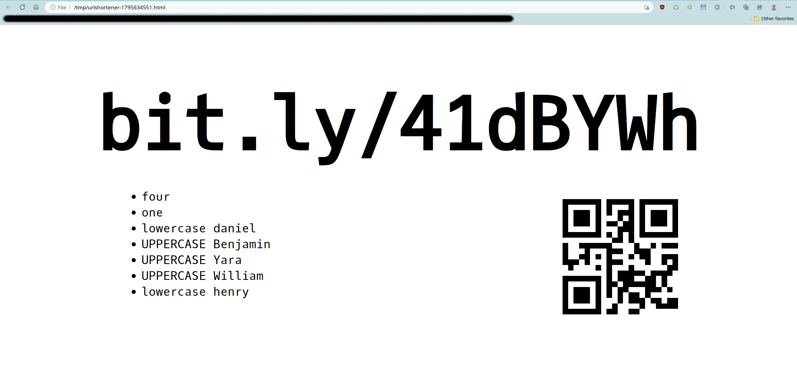

# URL Shortener (Go)

A URL shortener command-line app. for [bit.ly](https://bitly.com/).
Implemented in Go, using [bit.ly's API v4](https://dev.bitly.com/api-reference/).

You can use it in interactive mode only.

## Installation

    $ go install github.com/jabbalaci/UrlShortener-go/cmd/urlshortener@latest

## Pre-requisite

For this to work, you need an access token from bit.ly. Don't worry, it's free.
After registration you can generate one for yourself. Then, add it as an
environment variable called `BITLY_ACCESS_TOKEN`. For instance, under Linux
add the following line to the end of your `~/.bashrc` file:

```bash
export BITLY_ACCESS_TOKEN="..."
```

Under Linux, the copy to clipboard functionality requires the Linux
command `xsel`. You can install it via your package manager.

## Usage

    $ urlshortener
    Long URL: https://www.reddit.com

    https://bit.ly/3KmRGIy

    # expanded from shortened URL: https://www.reddit.com (matches)

    Copy shortened URL to clipboard [Yn]? y
    # copied ✓
    Zoom into this short URL [yN]? y
    # yes ✓
    # written to /tmp/urlshortener-2368855934.html

Provide the long URL, and it'll give you back the shortened bit.ly URL.

If you want, you can copy the short URL to the clipboard.

If you want, you can create a local HTML file that shows
the short URL using large fonts. This is useful if you do
a presentation / lecture and you quickly want to share a link with
your audience.

Screenshot of the local HTML page:

<div align="center">
  
</div>

The characters in the funny ID are also pronounced to
avoid confusion between similar characters like `o`, `O`, `0`, etc.
